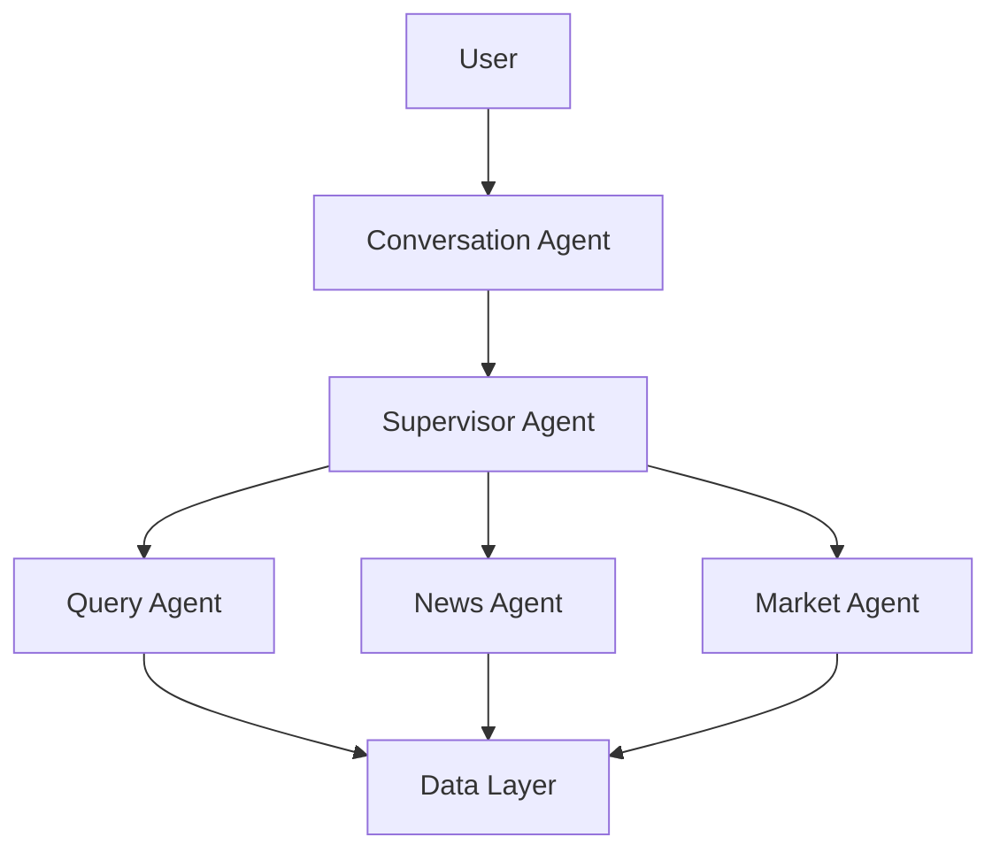

# Development Guide

## Local Development Setup

### Prerequisites

- Python 3.11+
- Docker & Docker Compose
- AWS CLI configured
- Make
- Git

### Environment Setup

```bash
# Clone repository
git clone <repository-url>
cd token_agents

# Create virtual environment
python -m venv venv
source venv/bin/activate  # On Windows: venv\Scripts\activate

# Install dependencies
pip install -r docker/langgraph/requirements.txt
pip install -r requirements-dev.txt  # Development dependencies

# Set up pre-commit hooks
pre-commit install
```

### Environment Variables

Create `env/.env_dev`:

```bash
# AWS
AWS_REGION=us-east-1
AWS_PROFILE=default

# Local development
LLM_BACKEND=ollama  # or litellm
OLLAMA_MODEL=llama2
MCP_MODE=stdio

# API Keys (for testing)
COINGECKO_API_KEY=test_key
CRYPTONEWS_TOKEN=test_token

# Feature flags
ENABLE_LANGFUSE=false
DEBUG=true
LOG_LEVEL=DEBUG
```

## Project Structure

```
token_agents/
├── deployment/              # Infrastructure as Code
│   ├── modules/            # Reusable Terraform modules
│   ├── main.tf             # Main infrastructure
│   └── lambda_ingest_container/  # Lambda function code
│
├── docker/                  # Container configurations
│   ├── langgraph/          # Multi-agent system
│   │   ├── app/
│   │   │   ├── agents/     # Agent implementations
│   │   │   │   ├── conversation_agent/
│   │   │   │   ├── supervisor_agent/
│   │   │   │   ├── query_agent/
│   │   │   │   ├── news_agent/
│   │   │   │   └── market_agent/
│   │   │   ├── tools/      # Agent tools
│   │   │   │   ├── market_tools/
│   │   │   │   ├── news_tools/
│   │   │   │   └── query_tools/
│   │   │   ├── prompts/    # System prompts
│   │   │   ├── vectors/    # Vector store clients
│   │   │   └── service.py  # BentoML service
│   │   ├── Dockerfile
│   │   └── requirements.txt
│   ├── spark/              # Spark cluster
│   └── openwebui/          # Optional UI
│
├── dbt/                     # Data transformations
│   └── coin_spark/
│       ├── models/
│       ├── macros/
│       └── dbt_project.yml
│
├── tests/                   # Test suites
│   ├── unit/
│   ├── integration/
│   └── e2e/
│
├── docs/                    # Documentation
├── sample_data/            # Sample datasets
├── Makefile               # Build automation
└── README.md
```

## Development Workflow

### 1. Feature Development

```bash
# Create feature branch
git checkout -b feature/new-agent

# Make changes
# ... edit files ...

# Run tests
pytest tests/

# Run linters
make lint

# Commit changes
git add .
git commit -m "feat: add new agent for X"

# Push and create PR
git push origin feature/new-agent
```

### 2. Local Testing

#### Test Individual Agents

```python
# tests/test_query_agent.py
import pytest
from agents.query_agent.graph import build_graph

@pytest.mark.asyncio
async def test_query_agent():
    graph = await build_graph()
    result = await graph.ainvoke({
        "messages": [{"role": "user", "content": "Show Bitcoin price"}]
    })
    assert "messages" in result
    assert len(result["messages"]) > 0
```

Run tests:
```bash
# All tests
pytest

# Specific test file
pytest tests/test_query_agent.py

# With coverage
pytest --cov=agents --cov-report=html

# Watch mode
pytest-watch
```

#### Test Tools

```python
# tests/test_tools.py
from tools.news_tools.tools import fetch_news_api_tool

def test_fetch_news():
    result = fetch_news_api_tool.invoke({
        "api_url": "https://test-api.com",
        "timeout_s": 10
    })
    assert result.items is not None
    assert isinstance(result.items, list)
```

#### Integration Tests

```python
# tests/integration/test_news_pipeline.py
import pytest
from agents.news_agent.graph import run_once

@pytest.mark.integration
@pytest.mark.asyncio
async def test_full_pipeline():
    result = await run_once(
        api_url="https://test-api.com",
        max_articles=5,
        ingest_mode="direct"
    )
    assert result["iceberg_count"] > 0
```

Run integration tests:
```bash
pytest -m integration
```

### 3. Local Services

#### Start Spark + dbt

```bash
# Start services
make compose-up-spark-dbt

# Access Spark shell
docker-compose -f docker/spark/docker-compose.yml exec spark-master spark-shell

# Run dbt
docker-compose -f docker/spark/docker-compose.yml exec spark-master dbt run

# Stop services
make compose-down-spark-dbt
```

#### Start LangGraph Service

```bash
# Build image
docker build -t langgraph-dev -f docker/langgraph/Dockerfile .

# Run service
docker run -p 3000:3000 \
  --env-file env/.env_dev \
  langgraph-dev

# Or use docker-compose
make compose-run-langgraph
```

#### Test Service Endpoints

```bash
# Health check
curl http://localhost:3000/health

# Invoke endpoint
curl -X POST http://localhost:3000/invoke \
  -H "Content-Type: application/json" \
  -d '{"message": "What is Bitcoin price?", "session_id": "test-123"}'

# OpenAI-compatible endpoint
curl -X POST http://localhost:3000/v1/chat/completions \
  -H "Content-Type: application/json" \
  -d '{
    "model": "crypto-agent",
    "messages": [{"role": "user", "content": "Show me Ethereum trends"}],
    "user": "test-user"
  }'
```

## Code Style & Standards

### Python Style Guide

Follow PEP 8 with these additions:

```python
# Good: Type hints
def process_data(items: List[Dict[str, Any]]) -> pd.DataFrame:
    """Process raw items into DataFrame.
    
    Args:
        items: List of dictionaries with raw data
        
    Returns:
        Processed DataFrame
        
    Raises:
        ValueError: If items is empty
    """
    if not items:
        raise ValueError("Items cannot be empty")
    return pd.DataFrame(items)

# Good: Docstrings
class NewsAgent:
    """Agent for processing cryptocurrency news.
    
    This agent fetches news from external APIs, extracts token mentions
    using LLMs, and stores results in vector databases.
    
    Attributes:
        api_url: URL for news API
        max_articles: Maximum articles to process per run
    """
    
    def __init__(self, api_url: str, max_articles: int = 50):
        self.api_url = api_url
        self.max_articles = max_articles

# Good: Error handling
try:
    result = api_call()
except requests.HTTPError as e:
    logger.error(f"API call failed: {e}", exc_info=True)
    raise
except Exception as e:
    logger.exception("Unexpected error")
    return default_value
```

### Linting & Formatting

```bash
# Install tools
pip install black isort flake8 mypy

# Format code
black .
isort .

# Check style
flake8 .

# Type checking
mypy agents/ tools/

# Or use pre-commit
pre-commit run --all-files
```

Configuration files:

**.flake8**:
```ini
[flake8]
max-line-length = 100
exclude = .git,__pycache__,venv,build,dist
ignore = E203,W503
```

**pyproject.toml**:
```toml
[tool.black]
line-length = 100
target-version = ['py311']

[tool.isort]
profile = "black"
line_length = 100

[tool.mypy]
python_version = "3.11"
warn_return_any = true
warn_unused_configs = true
disallow_untyped_defs = true
```

### Commit Messages

Follow Conventional Commits:

```
feat: add market agent for research synthesis
fix: resolve Aurora connection timeout
docs: update deployment guide
test: add integration tests for news pipeline
refactor: extract common vector search logic
chore: update dependencies
```

## Debugging

### Debug Agents

```python
# Enable debug logging
import logging
logging.basicConfig(level=logging.DEBUG)

# Or per-module
logger = logging.getLogger("agents.query_agent")
logger.setLevel(logging.DEBUG)

# Add breakpoints
import pdb; pdb.set_trace()

# Or use ipdb for better experience
import ipdb; ipdb.set_trace()
```

### Debug LangGraph

```python
# Print state at each step
for step in graph.stream(initial_state):
    print(f"Step: {step}")
    
# Visualize graph
from langgraph.graph import StateGraph
graph_builder = StateGraph(State)
# ... add nodes and edges ...
graph = graph_builder.compile()

# Generate Mermaid diagram
print(graph.get_graph().draw_mermaid())
```

### Debug Tools

```python
# Test tool independently
from tools.query_tools.dbt_tools import fetch_metrics_tool

result = fetch_metrics_tool.invoke({})
print(result)

# Mock external dependencies
from unittest.mock import Mock, patch

@patch('tools.news_tools.tools.requests.get')
def test_scrape(mock_get):
    mock_get.return_value.text = "<html>Test content</html>"
    result = scrape_article_text_tool.invoke({"url": "https://test.com"})
    assert "Test content" in result.text
```

### Debug Docker Containers

```bash
# View logs
docker-compose -f docker/spark/docker-compose.yml logs -f spark-master

# Execute commands in container
docker-compose -f docker/spark/docker-compose.yml exec spark-master bash

# Inspect container
docker inspect <container-id>

# Check resource usage
docker stats
```

## Testing Strategy

### Unit Tests

Test individual functions and classes:

```python
# tests/unit/test_tools.py
def test_dedupe_news():
    items = [
        {"news_id": "1", "title": "Bitcoin rises"},
        {"news_id": "1", "title": "Bitcoin rises"},  # Duplicate
        {"news_id": "2", "title": "Ethereum falls"}
    ]
    result = dedupe_news_ids(items)
    assert len(result) == 2
    assert result[0]["news_id"] == "1"
    assert result[1]["news_id"] == "2"
```

### Integration Tests

Test component interactions:

```python
# tests/integration/test_vector_search.py
@pytest.mark.integration
def test_vector_search_flow():
    # 1. Store documents
    store_documents(docs)
    
    # 2. Search
    results = search_vectors(query)
    
    # 3. Verify
    assert len(results) > 0
    assert results[0]["score"] > 0.7
```

### End-to-End Tests

Test full workflows:

```python
# tests/e2e/test_query_flow.py
@pytest.mark.e2e
@pytest.mark.asyncio
async def test_user_query_flow():
    # 1. User sends query
    response = await conversation_agent.invoke({
        "messages": [{"role": "user", "content": "Bitcoin price last week"}]
    })
    
    # 2. Verify response structure
    assert "messages" in response
    last_message = response["messages"][-1]
    
    # 3. Verify content
    assert "bitcoin" in last_message.content.lower()
    assert any(char.isdigit() for char in last_message.content)
```

### Test Fixtures

```python
# tests/conftest.py
import pytest
from unittest.mock import Mock

@pytest.fixture
def mock_llm():
    """Mock LLM for testing without API calls."""
    llm = Mock()
    llm.invoke.return_value = {"content": "Test response"}
    return llm

@pytest.fixture
def sample_news_items():
    """Sample news data for testing."""
    return [
        {
            "news_id": "1",
            "title": "Bitcoin reaches new high",
            "date": "2025-01-15",
            "url": "https://example.com/1"
        },
        {
            "news_id": "2",
            "title": "Ethereum upgrade announced",
            "date": "2025-01-16",
            "url": "https://example.com/2"
        }
    ]

@pytest.fixture
async def test_graph():
    """Build graph for testing."""
    from agents.query_agent.graph import build_graph
    return await build_graph(config={"model": "test-model"})
```

### Mocking External Services

```python
# tests/mocks.py
from unittest.mock import Mock, AsyncMock

class MockBedrockClient:
    def __init__(self):
        self.invoke_model = Mock(return_value={
            "body": '{"content": "Test response"}'
        })

class MockS3Client:
    def __init__(self):
        self.put_object = Mock(return_value={"ETag": "test-etag"})
        self.get_object = Mock(return_value={
            "Body": Mock(read=lambda: b"test content")
        })

# Use in tests
@patch('boto3.client')
def test_with_mock_aws(mock_boto_client):
    mock_boto_client.return_value = MockBedrockClient()
    # ... test code ...
```

## Performance Profiling

### Profile Python Code

```python
# Using cProfile
import cProfile
import pstats

profiler = cProfile.Profile()
profiler.enable()

# Code to profile
result = expensive_function()

profiler.disable()
stats = pstats.Stats(profiler)
stats.sort_stats('cumulative')
stats.print_stats(20)  # Top 20 functions
```

### Profile Memory Usage

```python
# Using memory_profiler
from memory_profiler import profile

@profile
def memory_intensive_function():
    large_list = [i for i in range(10000000)]
    return sum(large_list)

# Run with: python -m memory_profiler script.py
```

### Profile Async Code

```python
# Using py-spy
# Install: pip install py-spy

# Profile running process
py-spy record -o profile.svg --pid <pid>

# Profile script
py-spy record -o profile.svg -- python script.py
```

### Benchmark Tools

```python
# Using pytest-benchmark
def test_vector_search_performance(benchmark):
    result = benchmark(search_vectors, query="Bitcoin")
    assert len(result) > 0

# Run: pytest --benchmark-only
```

## Documentation

### Code Documentation

```python
def process_news_article(
    article: Dict[str, Any],
    extract_tokens: bool = True,
    temperature: float = 0.3
) -> Dict[str, Any]:
    """Process a single news article.
    
    Scrapes full text, extracts token mentions using LLM, and enriches
    the article with metadata.
    
    Args:
        article: Raw article data from API with keys:
            - news_id: Unique identifier
            - title: Article headline
            - url: Article URL
        extract_tokens: Whether to extract token mentions via LLM
        temperature: LLM temperature for extraction (0.0-1.0)
        
    Returns:
        Enriched article dictionary with additional keys:
            - full_text: Scraped article content
            - currencies: List of extracted token symbols
            - sentiment: Overall article sentiment
            
    Raises:
        ValueError: If article is missing required fields
        requests.HTTPError: If scraping fails
        
    Example:
        >>> article = {"news_id": "1", "title": "Bitcoin rises", "url": "..."}
        >>> result = process_news_article(article)
        >>> print(result["currencies"])
        ["BTC", "ETH"]
    """
    # Implementation...
```

### API Documentation

Use OpenAPI/Swagger for REST APIs:

```yaml
# openapi.yaml
openapi: 3.0.0
info:
  title: Crypto Intelligence API
  version: 1.0.0
paths:
  /invoke:
    post:
      summary: Invoke agent with message
      requestBody:
        content:
          application/json:
            schema:
              type: object
              properties:
                message:
                  type: string
                session_id:
                  type: string
      responses:
        '200':
          description: Successful response
          content:
            application/json:
              schema:
                type: object
                properties:
                  ok:
                    type: boolean
                  response:
                    type: string
```

### Architecture Diagrams

Use Mermaid for diagrams in Markdown:

````markdown

````

## Continuous Integration

### GitHub Actions

```yaml
# .github/workflows/ci.yml
name: CI

on: [push, pull_request]

jobs:
  test:
    runs-on: ubuntu-latest
    steps:
      - uses: actions/checkout@v3
      
      - name: Set up Python
        uses: actions/setup-python@v4
        with:
          python-version: '3.11'
          
      - name: Install dependencies
        run: |
          pip install -r requirements.txt
          pip install -r requirements-dev.txt
          
      - name: Run linters
        run: |
          black --check .
          flake8 .
          mypy agents/ tools/
          
      - name: Run tests
        run: |
          pytest --cov=agents --cov=tools --cov-report=xml
          
      - name: Upload coverage
        uses: codecov/codecov-action@v3
        with:
          file: ./coverage.xml
```

## Troubleshooting

### Common Development Issues

**1. Import Errors**
```bash
# Ensure PYTHONPATH is set
export PYTHONPATH="${PYTHONPATH}:$(pwd)/docker/langgraph/app"

# Or use editable install
pip install -e docker/langgraph/
```

**2. Docker Build Fails**
```bash
# Clear cache
docker builder prune

# Build with no cache
docker build --no-cache -t image-name .

# Check disk space
docker system df
docker system prune
```

**3. Tests Fail Locally**
```bash
# Clean pytest cache
pytest --cache-clear

# Run with verbose output
pytest -vv

# Run specific test
pytest tests/test_file.py::test_function -vv
```

**4. MCP Connection Issues**
```bash
# Check MCP server is running
ps aux | grep mcp

# Test MCP connection
python -c "from tools.query_tools.mcp_tools import test_connection; test_connection()"

# Check logs
tail -f logs/mcp.log
```

## Best Practices

1. **Write tests first** (TDD approach)
2. **Keep functions small** (< 50 lines)
3. **Use type hints** everywhere
4. **Document public APIs** thoroughly
5. **Handle errors gracefully**
6. **Log important events**
7. **Avoid premature optimization**
8. **Review your own code** before PR
9. **Keep dependencies minimal**
10. **Update docs** with code changes

## Resources

- [LangGraph Documentation](https://langchain-ai.github.io/langgraph/)
- [LangChain Documentation](https://python.langchain.com/)
- [AWS Bedrock Documentation](https://docs.aws.amazon.com/bedrock/)
- [dbt Documentation](https://docs.getdbt.com/)
- [Apache Spark Documentation](https://spark.apache.org/docs/latest/)
- [Pytest Documentation](https://docs.pytest.org/)
